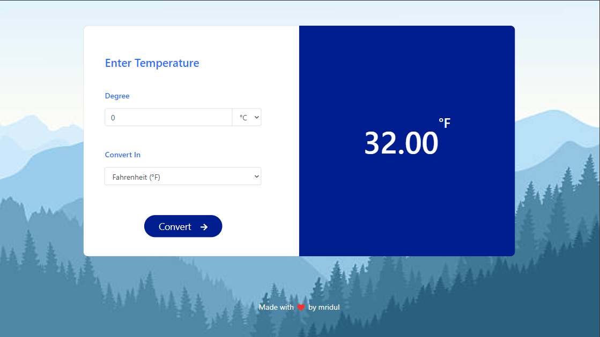

<h2 align="center">
  Temperature Converter - 
  <a href="https://temperature-converter-mridul.vercel.app/" target="_blank">Temperature Converter</a>  
  
Welcome to my Temperature Converter web app!

</h2>

  

## Table of Contents

- [Introduction](#introduction)
- [Technologies Used](#technologies-used)
- [Features](#features)
- [License](#license)

## Introduction

This project is a simple yet powerful Temperature Converter built with HTML, CSS, JavaScript, and Bootstrap. Enter a temperature in Celsius, Fahrenheit, or Kelvin, and convert it to your desired unit!

## Technologies Used

This Temperature Converter web app was built using the following technologies:
 
- HTML
- CSS
- JavaScript (jQuery)
- Bootstrap 4.6
- VsCode
- Vercel

## Features

- Responsive design
- Real-time temperature conversion
- Supports Celsius, Fahrenheit, and Kelvin

## License

This project is licensed under the [MIT License](LICENSE).

## Contact

Feel free to reach out to me at [mridulmkumar07@gmail.com](mailto:mridulmkumar07@gmail.com) or visit my website <a href="https://mridul0703.vercel.app/" target="_blank">mridul.app</a> for more information.

## Show your support

Give a ⭐ if you like this web app!
